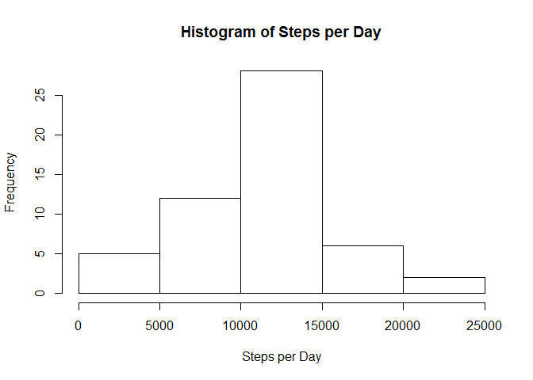

# Reproducible Research: Peer Assessment 1


## Loading and preprocessing the data


```r
#Set working directory, load the data, and load the libraries
setwd("R:/5-Reproducible/RepData_PeerAssessment1")
rawdata <- data.frame(read.csv("activity.csv"))
library(dplyr)
```

```
## 
## Attaching package: 'dplyr'
## 
## The following object is masked from 'package:stats':
## 
##     filter
## 
## The following objects are masked from 'package:base':
## 
##     intersect, setdiff, setequal, union
```

```r
library(lattice)

#Summarize total steps by date
stepsByDate <- rawdata %>% 
      filter(!is.na(steps)) %>% 
      group_by(date) %>% 
      select(steps) %>% 
      summarize(totalSteps = sum(steps))
```

## What is mean total number of steps taken per day?


```r
hist(stepsByDate$totalSteps, main="Histogram of Steps per Day", xlab="Steps per Day")
```

 

### Mean of total steps per day (raw data, exluding NA values):


```r
mean(stepsByDate$totalSteps)
```

```
## [1] 10766.19
```

### Median of total steps per day (raw data, exluding NA values):


```r
median(stepsByDate$totalSteps)
```

```
## [1] 10765
```

## What is the average daily activity pattern?


```r
#Obtain the mean steps for each interval across all days
stepsByInterval <- rawdata %>% 
      filter(!is.na(steps)) %>% 
      group_by(interval) %>% 
      select(steps) %>% 
      summarize(meanSteps = mean(steps))

plot(stepsByInterval$interval, stepsByInterval$meanSteps, type="l", 
     xlab="Interval Number", ylab="Mean Steps Per Interval") 
```

 

### Which interval number has the greatest mean number of steps?


```r
maxMeanSteps <- max(stepsByInterval$meanSteps)
intervalWithMaxMeanSteps <- (stepsByInterval %>% filter(meanSteps == maxMeanSteps))$interval
intervalWithMaxMeanSteps 
```

```
## [1] 835
```

## Imputing missing values

### How many activity rows have missing values?


```r
#Number of rows with NA values
length((rawdata %>% filter(is.na(steps)))$steps)  #Print this, missing values 1
```

```
## [1] 2304
```

### Mean of total steps per day (with imputed values):


```r
rawMeanStepsPerDay <- mean(stepsByDate$totalSteps)
rawMedianStepsPerDay <- median(stepsByDate$totalSteps)
```

### Median of total steps per day (with imputed values for):


```r
rawMeanStepsPerDay 
```

```
## [1] 10766.19
```

```r
rawMedianStepsPerDay 
```

```
## [1] 10765
```

### For each interval with a missing value, assign to it the mean for that interval across all days


```r
cleandata <- rawdata

#Using mean stepsByInterval vector from above, distribute the mean steps per interval into 
#a new vector meanStepsForInterval representing one value per measurement in the raw data set
meanStepsForInterval <- sapply(cleandata$interval, 
      function(x){
            as.numeric(stepsByInterval[ which(stepsByInterval$interval == x), 2])
            })

#Add the vector meanStepsForInterval as a new temporary column of the cleandata data frame
cleandata$meanStepsForInterval <- meanStepsForInterval

#For each missing steps value, impute the mean for that interval
cleandata$steps <- with(cleandata, ifelse(is.na(steps), meanStepsForInterval, steps))

#Remove the temporary meanStepsForInterval column from cleandata
cleandata$meanStepsForInterval <- NULL

#Summarize  the clean/imputed data set by date
cleanStepsByDate <- cleandata %>% 
      group_by(date) %>% 
      select(steps) %>% 
      summarize(totalSteps = sum(steps))

hist(cleanStepsByDate$totalSteps, xlab="Steps by Date", 
     main="Steps by Date Including Imputed Values")
```

 

### Mean steps per day (including imputed values)


```r
cleanMeanStepsPerDay <- mean(cleanStepsByDate$totalSteps)
cleanMeanStepsPerDay
```

```
## [1] 10766.19
```

### Median steps per day (including imputed values)


```r
cleanMedianStepsPerDay <- median(cleanStepsByDate$totalSteps)
cleanMedianStepsPerDay 
```

```
## [1] 10766.19
```

## Are there differences in activity patterns between weekdays and weekends?


```r
#Add new "DayType" column indicating whether the day is a "weekend" or a "weekday"
cleandata <- cleandata %>% 
      mutate(DayType = as.factor(ifelse(weekdays(as.POSIXlt(date)) 
            %in% c("Saturday", "Sunday"), "weekend", "weekday")))

#Summarize the clean/imputed set by interval and day type
cleanStepsByInterval <- cleandata %>% 
      group_by(interval,DayType) %>% 
      select(steps) %>% 
      summarize(meanSteps = mean(steps))

xyplot(meanSteps~interval | factor(DayType), 
       data=cleanStepsByInterval, type="l",layout=c(1,2),
       ylab="Mean Number of Steps per Interval", xlab="Interval", 
       main="Comparison of weekday and weekend steps by interval")
```

 
